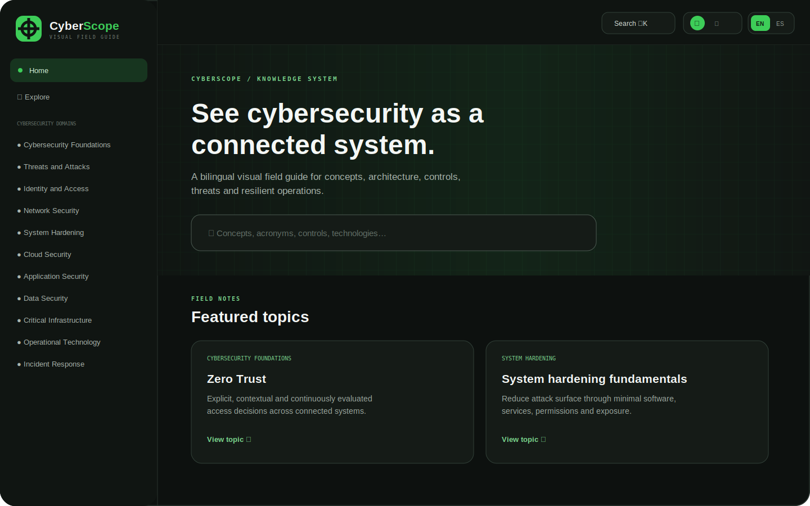

# CyberScope

CyberScope is an installable, bilingual cybersecurity field guide for freely exploring defensive concepts, architectures, technologies, controls, threats and resilient operations. It behaves like a visual handbook and technical knowledge base—not a course. There are no accounts, required paths, quizzes, scores, achievements or completion tracking.

The original identity combines an industrial grid, a geometric scope mark and an accessible electric-green accent (`#3DCD58`) with neutral light and near-black dark surfaces. It uses no third-party logos, stock imagery or trademarked brand assets.

## Screenshot



## Features

- 77 detailed bilingual topics across 17 cybersecurity domains.
- 300 bilingual, linkable glossary entries, with acronyms, aliases and related terms.
- 21 accessible visual diagrams, 10 comparison tables and 10 defensive reference checklists.
- 10 clearly labelled fictional practical examples.
- Dedicated, substantial coverage of critical infrastructure, operational technology and system hardening.
- Instant bilingual global search across titles, summaries, definitions, sections, acronyms, aliases and tags.
- Explorer filters for domain, difficulty, content type, technology, environment and defensive function.
- Grid/list views, sorting, active filter chips and useful empty states.
- Light and dark colour modes without a loading flash.
- English and Spanish (Spain), with one language shown consistently at a time.
- Local saved topics, recently viewed pages and search history without learning-progress semantics.
- Adjustable density, font size and reduced motion.
- Responsive desktop sidebar and accessible mobile navigation.
- PWA manifest, original SVG/PNG icons, service worker and offline fallback.
- Runtime content validation and a React error boundary.
- No backend, database, authentication, paid API, environment variable or secret key.

## Technology stack

- React and TypeScript
- Vite
- Tailwind CSS
- React Router with hash routing for static hosting compatibility
- Lucide React icons
- Local TypeScript content files
- LocalStorage for device-local preferences
- Standards-based web app manifest and service worker

## Local installation

Node.js 20.19 or later is recommended.

```bash
npm install
npm run dev
```

Vite prints the local development URL. The application does not need a `.env` file.

## Development commands

```bash
npm run dev       # development server
npm run typecheck # strict TypeScript check
npm run build     # typecheck and production bundle
npm run preview   # preview the production bundle
```

## Production build

```bash
npm install
npm run build
```

The deployable output is written to `dist/`. The verified production build includes the application bundle, manifest, offline document, service worker, icons and GitHub Pages fallback.

## GitHub Pages deployment

The workflow at `.github/workflows/deploy.yml` builds and publishes the repository whenever `main` is pushed. In the repository settings, choose **GitHub Actions** as the Pages source.

`vite.config.ts` derives the repository name from `GITHUB_REPOSITORY` during CI and sets Vite's base path to `/<repository>/`. Local builds use `/`. `HashRouter` keeps deep application routes compatible with GitHub Pages, while `public/404.html` supplies an additional static fallback.

## PWA installation

1. Build and serve over HTTPS (GitHub Pages provides HTTPS), or use a browser-supported local development origin.
2. Open CyberScope in a PWA-capable browser.
3. Use the browser's **Install app** action.

The service worker is registered only in production. It caches the application shell and fetched same-origin resources. Previously visited app content is normally available offline; external standards and references are not cached.

## Project structure

```text
.
├── .github/workflows/deploy.yml
├── docs/cyberscope-overview.svg
├── public/
│   ├── icons/
│   ├── 404.html
│   ├── manifest.webmanifest
│   ├── offline.html
│   └── sw.js
├── src/
│   ├── app/                 # providers, routes and error boundary
│   ├── components/
│   │   ├── content/         # cards, breadcrumbs, diagrams and tables
│   │   ├── layout/          # responsive shell and navigation
│   │   ├── search/          # reusable search field
│   │   ├── settings/        # theme and language controls
│   │   └── ui/              # product identity
│   ├── content/             # categories, topics, glossary and visual data
│   ├── lib/                 # i18n, search and runtime validation
│   ├── pages/               # complete route-level pages
│   ├── styles/              # Tailwind and design-system styles
│   └── types/               # strongly typed content contracts
├── index.html
├── tailwind.config.js
├── tsconfig*.json
└── vite.config.ts
```

## Content architecture

Presentation and content are separate. `src/types/content.ts` defines `CyberTopic`, `TopicSection`, `Category`, `Subcategory`, `Definition`, `GlossaryEntry`, `RelatedTopic`, `Diagram`, `ComparisonTable`, `Reference`, `Translation`, `UserPreferences`, `SavedTopic` and `SearchIndexEntry`.

`src/content/topics.ts` contains compact bilingual source records and expands them into the complete reusable topic template: definition, detailed explanation, why it matters, how it works, components, risks, controls, context, misconception, summary, related concepts, terminology, references and metadata. No long-form cybersecurity content is embedded in page components.

`src/lib/validateContent.ts` checks identifiers, bilingual fields, category references and minimum content coverage before React mounts. Invalid local content fails safely through the error boundary rather than rendering partial information.

## Translation architecture

Every content field uses a typed `{ en, es }` value. Interface strings live in `src/lib/i18n.ts`; domain content lives in `src/content/`. The selected language is loaded from LocalStorage before React renders and updates the document language.

English is the default. Spanish uses professional Spanish from Spain. Widely used professional terms such as *ransomware*, *phishing*, *cloud*, *endpoint*, *threat hunting* or *Zero Trust* remain in English where that reflects common usage, with Spanish explanations around them.

## Adding a topic

1. Add a unique source record to `seeds` in `src/content/topics.ts`.
2. Supply equivalent English and Spanish title, summary, importance, risk and defensive-control text.
3. Assign one of the category identifiers from `src/content/categories.ts`.
4. Optionally associate a diagram, comparison or checklist identifier from `src/content/visuals.ts`.
5. Add useful acronyms and related search aliases.
6. Run `npm run build`; runtime validation also checks the complete content model.

## Adding a glossary term

Add a six-field record to `extra` in `src/content/glossary.ts`: unique ID, English term, Spanish term, category, English definition and Spanish definition. Topic titles and aliases are also indexed automatically. Every entry receives a detailed definition, related terms and search aliases.

## Updating translations

- Interface text: update both values in `src/lib/i18n.ts`.
- Topic text: update the paired fields in `src/content/topics.ts`.
- Glossary names or dedicated translations: update `translations` or `extra` in `src/content/glossary.ts`.
- Category navigation and overview text: update `src/content/categories.ts`.

Never add only one language. Run the production build after every content change.

## Accessibility

CyberScope uses semantic landmarks, a skip link, heading hierarchy, labelled forms, visible focus rings, keyboard-operable controls, `aria-pressed` state, accessible mobile dialogs and screen-reader descriptions for diagrams. Information is not communicated by colour alone. Text scales through browser zoom and the local font-size setting. Reduced motion disables transitions and smooth scrolling.

The light and dark palettes are designed for strong text contrast. Charts and diagrams use labelled nodes, borders and textual explanations in addition to colour.

## Privacy

There is no account, analytics, advertising, telemetry or tracking. LocalStorage contains only the chosen language, theme, density, font size, reduced-motion setting, saved topic IDs, recently viewed paths and search-history strings. All can be erased in Settings. Opening an external reference is a separate visit governed by that website.

## Security

- No user-supplied HTML and no `dangerouslySetInnerHTML`.
- No secrets, environment variables or remote executable scripts.
- External links use `target="_blank"` with `rel="noopener noreferrer"`.
- Local content is strongly typed and validated at runtime.
- Search renders text as React nodes, including highlighting, rather than as HTML.
- The default `index.html` includes a restrictive meta Content Security Policy.

For a production deployment under a server that supports HTTP headers, prefer this CSP as a response header and test it against the final asset set:

```text
Content-Security-Policy: default-src 'self'; script-src 'self'; style-src 'self' 'unsafe-inline'; img-src 'self' data:; font-src 'self'; connect-src 'self'; worker-src 'self'; manifest-src 'self'; base-uri 'self'; form-action 'self'; object-src 'none'; frame-ancestors 'none'
```

GitHub Pages does not offer arbitrary response headers, so the included meta policy provides partial defence; `frame-ancestors` requires an HTTP response header to take effect.

## Offline limitations

- First use requires a connection to download the application.
- Only same-origin resources already cached by the service worker are available offline.
- External framework pages and further-reading links require a connection.
- Clearing site data removes the cache and LocalStorage preferences.
- Content updates are received when the browser reconnects and refreshes the service worker cache.

## Browser compatibility

Current stable versions of Chrome, Edge, Firefox and Safari are supported. PWA installation behaviour differs by browser and operating system. JavaScript, CSS Grid, LocalStorage and service workers are required for the complete experience.

## Contributing

1. Create a focused branch.
2. Keep content defensive, ethical, technically accurate and equivalent in English and Spanish.
3. Do not add exploit payloads, credential-theft workflows, bypass instructions or operational details that could endanger real infrastructure.
4. Preserve keyboard access, focus visibility, semantic structure and both colour themes.
5. Run `npm run typecheck` and `npm run build`.
6. Describe content, accessibility and visual changes in the pull request.

## Licence

The repository uses the MIT Licence. This is a permissive recommendation suitable for an original open-source reference application; organisations should review their own content and contribution requirements.

## Future improvements

- Optional downloadable content packs for finer offline control.
- More sector-specific defensive architecture diagrams.
- Print-optimised topic and glossary views.
- Community translation review workflow.
- Automated accessibility regression testing in CI.
- Local import/export of saved topics without introducing accounts.

## Safety boundary

CyberScope is defensive education and reference material. Attack-related entries explain meaning, warning signs, consequences, detection, mitigation, containment and recovery. They do not contain malware, executable exploit payloads, credential-theft instructions, destructive commands, real-target reconnaissance or procedures for attacking industrial systems.
